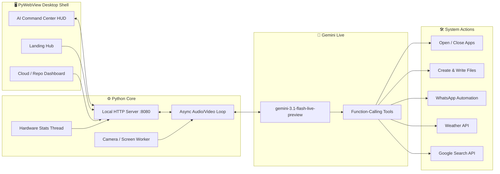

<div align="center">


<br/>

[](https://www.python.org/)
[](https://ai.google.dev/)
[](#)
[](#)
[](#-license)

[](https://github.com/MASTER870-CMD)
[](https://github.com/MASTER870-CMD)
[](https://github.com/MASTER870-CMD)

</div>

<br/>

## 📡 What is ELIVORA?

**ELIVORA** is a full-stack, local-first **AI operating agent** for Windows — a real-time, voice-driven system co-pilot that can *see* your screen or camera, *hear* your commands, *speak* back in a natural voice, and *act* directly on your machine: launching apps, killing processes, writing files, messaging contacts on WhatsApp, checking the weather, and pulling live facts off the web — all through a single always-on desktop HUD.

It's not a chatbot wrapper. It's a persistent background system with its own audio pipeline, vision pipeline, process manager, local web server, and a GitHub-connected deployment dashboard — wired together into one native desktop application.

<div align="center">

</div>

---

## 🎯 Core Capabilities

<table>
<tr>
<td width="50%" valign="top">

### 🎙️ Real-Time Voice Intelligence
Full duplex, low-latency conversation powered by the **Gemini Live API**, with barge-in support — ELIVORA stops talking the instant you start.

### 👁️ Live Vision
Streams your **webcam or full screen** straight into the model's context, so it can literally see what you see and reason about it in real time.

### 🖥️ System Command Authority
Opens and force-closes any installed application by name, using a self-updating index built from a live Windows `Get-StartApps` scan.

</td>
<td width="50%" valign="top">

### ✍️ Autonomous File Generation
Ask for an essay, article, or note — it writes the full content and drops a ready `.txt` file straight onto your Desktop, opened automatically.

### 💬 WhatsApp GUI Automation
Drives your keyboard and mouse to open WhatsApp, search a contact, and fire off a message — zero manual clicks.

### ☁️ Cloud & Repository Hub
A built-in local dashboard for browsing, previewing, and managing GitHub repositories and deployments, rendered as its own SaaS-style panel.

</td>
</tr>
</table>

### More under the hood

- 🌦️ **Live weather lookups** via Open-Meteo geocoding + forecast APIs
- 🔎 **Google Custom Search** tool the AI calls autonomously whenever it doesn't know something
- 📊 **Live hardware telemetry** — CPU, RAM, battery, network status, and ping, streamed to the HUD every second
- 🔁 **Self-healing multi-key rotation** — automatically rotates across a pool of Gemini API keys on quota exhaustion or disconnects, so the assistant never goes silent
- 🪟 **Three embedded dashboards** served from a local HTTP server: a landing **Hub**, the **AI Command Center**, and the **Cloud Host** panel
- 🎚️ Mic mute, mini-mode, and graceful terminate controls, all wired to the native desktop shell

---

## 🧠 Architecture



---

## 🧰 Tech Stack

<div align="center">

| Layer | Technology |
|---|---|
| **AI Engine** | Google Gemini Live API (`gemini-3.1-flash-live-preview`) |
| **Desktop Shell** | PyWebView |
| **Audio** | PyAudio, NumPy (RMS-based voice interrupt) |
| **Vision** | OpenCV, Pillow, `ImageGrab` (screen capture) |
| **System Control** | psutil, PyAutoGUI, PowerShell (`Get-StartApps`) |
| **Backend Server** | Python `http.server` + `socketserver` (threaded) |
| **Frontend Dashboards** | HTML5, CSS3, Vanilla JS, Bootstrap 5, Chart.js |
| **Config / Secrets** | `python-dotenv` |

</div>

---

## 🚀 Getting Started

### 1 — Clone the repository

```bash
git clone https://github.com/MASTER870-CMD/ELIVORA.git
cd ELIVORA
```

### 2 — Install dependencies

```bash
pip install psutil pywebview numpy pyautogui opencv-python pillow pyaudio python-dotenv google-genai
```

### 3 — Configure your environment

Create a `.env` file in the project root:

```env
GEMINI_API_KEYS=your_key_1,your_key_2,your_key_3
GOOGLE_SEARCH_API_KEY=your_google_search_api_key
GOOGLE_SEARCH_CX=your_search_engine_id
GITHUB_DEFAULT_TOKEN=your_github_token
```

> ⚠️ **Never commit your `.env` file.** Add it to `.gitignore` before pushing.

### 4 — Launch ELIVORA

```bash
python ap.py
```

The desktop window boots straight into the **Hub**, backed by a local server at `http://127.0.0.1:8080`.

---

## 🗂️ Project Structure

```
ELIVORA/
├── ap.py                  # Main entry point — AI loop, server, desktop shell
├── local_apps_db.json     # Auto-generated index of installed applications
├── .env                   # Your local secrets (never commit this)
└── README.md
```

---

## 🛣️ Roadmap

- [ ] Cross-platform support (macOS / Linux system control)
- [ ] Plugin system for custom voice-triggered tools
- [ ] Persistent conversation memory across sessions
- [ ] Packaged `.exe` installer via PyInstaller

---

## 👨‍💻 About the Developer

<div align="center">

### Shashank Gowda NB

*Builder of ELIVORA — a full local AI operating agent, from audio pipeline to desktop shell to cloud dashboard, engineered solo end-to-end.*

[](https://github.com/MASTER870-CMD)


</div>

---

## 📄 License

This project is licensed under the **MIT License** — see the [LICENSE](LICENSE) file for details.

<div align="center">

</div>
